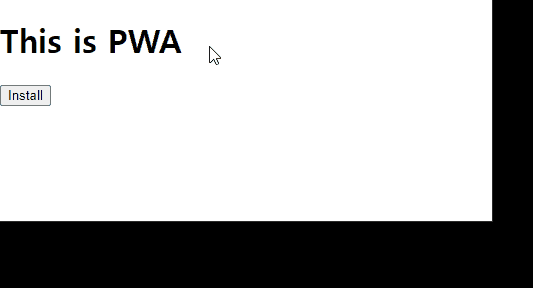

# use-pwa-install

[](https://github.com/qvil/use-pwa-install/actions/workflows/main.yml)

React hook for PWA(Progressive Web App) install

## Demo



## Install

```
npm i use-pwa-install
```

## Usage

```js
import React from 'react';
import usePWAInstall from 'use-pwa-install';

const App = () => {
  const { isInstalled, install } = usePWAInstall();

  return (
    <div>
      {isInstalled ? (
        <p>App is installed</p>
      ) : (
        <button onClick={install}>Install</button>
      )}
    </div>
  );
};
```

## Options

| options     | Type     | Description                                 | Required | Default Value |
| ----------- | -------- | ------------------------------------------- | -------- | ------------- |
| acceptedFn  | Function | Callback function to execute when accepted  | no       | console.log() |
| dismissedFn | Function | Callback function to execute when dismissed | no       | console.log() |
| installedFn | Function | Callback function to execute when installed | no       | console.log() |

## Return value

| value       | Type     | Description          |
| ----------- | -------- | -------------------- |
| isInstalled | boolean  | Install state        |
| install     | Function | App install function |

## Browser compatibility

- https://developer.mozilla.org/en-US/docs/Web/API/BeforeInstallPromptEvent#browser_compatibility
- https://developer.mozilla.org/en-US/docs/Web/API/Window/appinstalled_event#browser_compatibility
